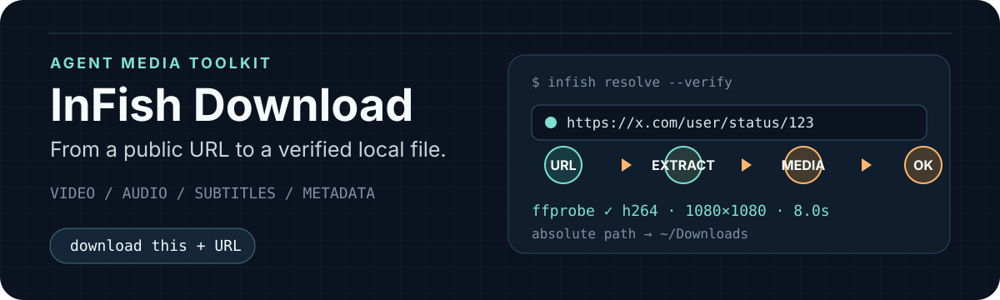
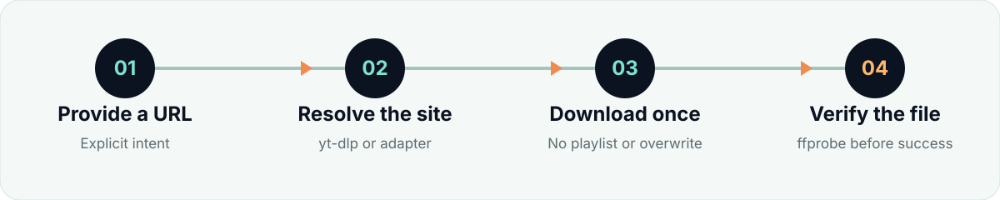

# InFish Download

> 对 Agent 说一句“下载这个：URL”，自动识别媒体、选择下载路径，并在完成后验证文件是否真的可播放。

[](https://github.com/Capper-Zou/InFish-download/releases)
[](LICENSE)
[](https://github.com/yt-dlp/yt-dlp)

<p align="center">
  
</p>

InFish Download 是一个面向 Agent 的通用媒体下载 Skill。它把视频、音频、字幕和媒体信息查询统一到一个入口，并对下载结果执行 `ffprobe` 验证。默认保存到 `~/Downloads`。

```text
你：下载这个：https://x.com/user/status/123

Agent：下载完成
文件：~/Downloads/example-video.mp4
画面：1080 × 1080 · H.264
时长：8 秒
验证：ffprobe 通过
```

<p align="center">
  
</p>

## 核心能力

- **自然语言触发**：支持“下载这个”“保存这个”“download this”等表达。
- **统一媒体入口**：视频、MP3、字幕、媒体信息使用同一套命令。
- **多平台解析**：覆盖 YouTube、B站、X、抖音、TikTok、小红书、Instagram、Facebook、Vimeo、Twitch、Reddit、微博、AcFun 等 `yt-dlp` 支持的平台。
- **视频号内置适配**：包含预检、本地连接、媒体下载、解密和编码验证流程。
- **Spotify 单曲匹配**：读取公开曲目信息，匹配一个公开音频来源，写入标题、艺人和专辑标签。
- **公开访问优先**：先匿名解析；公开访问失败时，最多回退一次本机浏览器 Cookie。
- **结果验证**：检查媒体流、编码、分辨率、时长和文件大小后才报告完成。
- **保护已有文件**：禁止自动扩张播放列表，不覆盖同名文件，并通过任务锁避免重复下载。

## 支持的平台

平台支持情况取决于当前安装的 `yt-dlp` extractor 和目标网站状态。

| 平台 | 状态 | 说明 |
|---|---|---|
| YouTube / Shorts | 已验证 | 视频、MP3、字幕和元数据 |
| B站 / Bilibili | 已验证 | 高清或会员内容取决于已有账号权限 |
| X / Twitter | 已验证 | 普通帖子视频下载与媒体验证 |
| 抖音 / TikTok | 动态探测 | 页面受限时可能需要本机会话 |
| 小红书 | 动态探测 | 仅链接解析和命令行下载，不操作网页 UI |
| Instagram / Facebook | 动态探测 | 私密内容需要已有登录会话 |
| Vimeo / Twitch / Reddit | 动态探测 | 支持普通视频、VOD、Clip 等内容 |
| 微博 / AcFun | 动态探测 | 能力取决于当前 extractor |
| Spotify 单曲 | 内置适配 | Spotify 提供元数据，公开来源提供音频 |
| 微信视频号 | 内置适配 | 本地连接优先，必要时由用户手动播放一次 |
| 其他 HTTPS 页面 | 动态探测 | `yt-dlp` 能识别媒体时即可处理 |

## 安装

```bash
npx skills add Capper-Zou/InFish-download
```

系统依赖：

- Python 3.10+
- `yt-dlp`
- `ffmpeg`
- `ffprobe`

macOS：

```bash
brew install yt-dlp ffmpeg
```

Ubuntu / Debian：

```bash
sudo apt update
sudo apt install ffmpeg
python3 -m pip install --user --upgrade yt-dlp
```

检查环境：

```bash
python3 scripts/download.py doctor --upgrade
```

## 使用方式

安装后，可以直接对 Agent 说：

```text
下载这个：https://x.com/user/status/123
保存这个：https://www.xiaohongshu.com/explore/example
把这个 B 站视频下载成 1080p：https://www.bilibili.com/video/BV123
提取这个 YouTube 视频的 MP3：https://youtu.be/example
下载这个视频的中英文字幕：https://youtube.com/watch?v=example
下载这个视频号：https://weixin.qq.com/sph/example
下载这首：https://open.spotify.com/track/example
```

只有明确表达下载或保存意图时才会自动触发。单独发送 URL，或者要求总结网页、下载图片和 PDF，不会触发本 Skill。

## 命令行

```bash
# 检查依赖和 yt-dlp 更新
python3 scripts/download.py doctor --upgrade

# 下载最高可用画质
python3 scripts/download.py download 'https://x.com/user/status/123'

# 限制清晰度
python3 scripts/download.py download URL --quality 1080p

# 提取 MP3
python3 scripts/download.py audio 'https://youtu.be/example'

# 下载字幕
python3 scripts/download.py subtitles URL --langs 'zh.*,en.*'

# 只读取媒体信息
python3 scripts/download.py info URL
```

默认输出目录是 `~/Downloads`。可使用 `--dir` 或环境变量 `INFISH_DOWNLOAD_OUTPUT` 指定其他目录。

## 下载完成标准

命令退出成功并不等于媒体可用。InFish Download 只有在以下条件全部满足时才返回 `ok: true`：

- 文件存在且大小大于 0
- 包含预期的视频流或音频流
- 时长有效
- `ffprobe` 可以读取容器与编码信息
- 返回经过验证的绝对文件路径

失败或中断时，只清理本次任务产生的临时分片，不删除已有媒体文件。

## Cookie 与隐私

默认采用 `public first` 策略：

1. 先不使用 Cookie 访问公开媒体。
2. 公开访问失败时，最多尝试一次本机 Chrome、Edge、Firefox 或 Safari Cookie。
3. 不复制、保存或打印 Cookie 内容。
4. 可以通过 `--cookies-from-browser none` 完全禁用 Cookie 回退。

```bash
python3 scripts/download.py download URL --cookies-from-browser none
```

## 微信视频号与风控平台

- 不使用 Computer Use、Accessibility、AppleScript 或浏览器自动化操作微信、小红书等客户端和页面。
- 登录、验证码、短信验证和安全检查始终由用户手动完成。
- 视频号优先使用已经连接的本地后端；需要页面播放时，只请求用户手动操作一次。
- 未经明确同意，不向在线解析器发送视频号分享 URL。
- 不绕过 DRM、付费墙、会员权限、地区限制或其他访问控制。

## 项目结构

```text
SKILL.md                    Skill 入口与执行约束
manifest.json               包身份、能力和发布门槛
agents/interface.yaml       Agent 展示与默认提示词
scripts/download.py         通用下载入口
scripts/spotify_adapter.py  Spotify 单曲匹配适配器
scripts/wechat_adapter.py   微信视频号统一适配器
scripts/wechat/             视频号预检、下载和后端安装组件
references/                 工作流、平台、安全与视频号说明
tests/                      单元测试
evals/                      触发边界和输出评测数据
reports/                    设计与验证记录
```

## 验证

```bash
python3 -m unittest discover -s tests -p 'test_*.py'
python3 scripts/trigger_eval.py .
python3 scripts/validate_skill.py .
```

项目基于 [yt-dlp](https://github.com/yt-dlp/yt-dlp) 提供通用媒体解析能力。视频号本地后端适配使用锁定版本并进行哈希校验。请仅下载你有权访问和保存的内容。

## License

[MIT](LICENSE)
